ant-design-vue-pro

## Project setup
```
npm install
```

### Compiles and hot-reloads for development
```
npm run serve
```

### Compiles and minifies for production
```
npm run build
```

### Run your unit tests
```
npm run test:unit
```

### Lints and fixes files
```
npm run lint
```

### Customize configuration
See [Configuration Reference](https://cli.vuejs.org/config/).


### 33 | 如何自定义 Webpack 和 Babel 配置
2020/04/20 18:37

如果项目工程创建伊始没有引入 `ant-design-vue` 的 JS 组件库的话，请通过如下命令引入：
```sh
npm install --save ant-design-vue
```

#### 引入组件
在入口文件 `main.js` 中引入
```js
import Antd from "ant-design-vue";
```
然后通过如下方式将 `ant-design-vue` 提供给我们的所有的组件都全局注册：
```js
Vue.use(Antd);
```
这个时候我们就可以使用了。我们在 `App.vue` 中尝试使用一个按钮：

```html
<!-- 使用 ant-design-vue 的按钮 -->
<a-button>按钮</a-button>
```

此时页面渲染如下：


竟然没有样式~！那是因为我们没有引入样式文件，我们通过下面的命令进行引入。

同样，也是在入口文件中进行引入：

```js
import "ant-design-vue/dist/antd.css";
```

> 如果是要用 ` css` 的话，后缀是 `.css`

再去页面确认，已经有样式了：

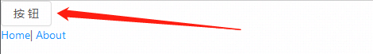


但是，我们是想用 `less`，因为后面我们想要自定义我们的主题，只需要将后缀名修改为 `.less` ：

```js
import "ant-design-vue/dist/antd.less";
```

这个时候，页面有报错信息：

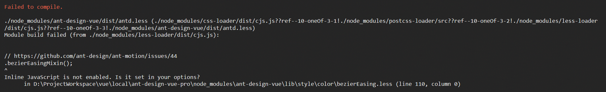

我们可以看到画面上有个 `Issue` 地址，显然这个地址和报错信息是有关的：

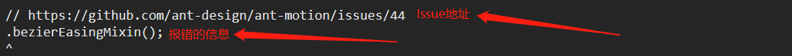

我们在浏览器中输入这个 `Issue` 地址，来到这个 Issue 下面：

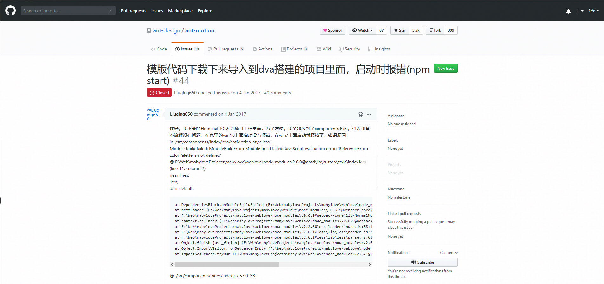

这里有个解决方法，可以查看点赞的人数，判断是否对自己有用：

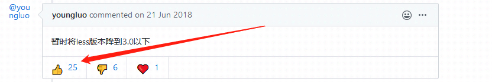

再往下，我们可以看到一个明确的解决方案：

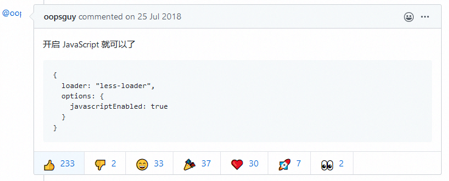

> 那就是开启 JavaScript 就可以了，也就是 `javascriptEnabled: true`

下面还有个解决方案，点赞人数比较多，回头可以尝试下：

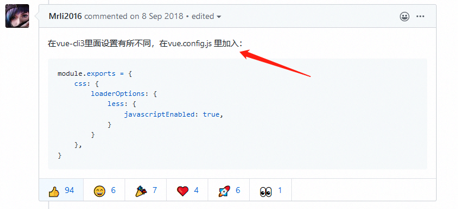


#### 配置 `webpack`

现在就根据提供的解决方案去配置我们的 `less - loader`，这个实际上就是我们 `webpack` 的一个配置，现在我们要做的就是，在我们的项目中，去自定义我们的 `webpack` 的配置。

因为，我们是依赖 CLI 脚手架生成我们的工程的，他在创建项目时，帮我们做了很多 `webpack` 的配置，那如果我们要自定义 `webpack` 的配置的话，就必须遵循 CLI 提供的一些接口的形式。

这个时候，我们去打开 CLI 官网，我们先要搜寻怎么配置 `webpack` 这样的一个配置。下面是 CLI 提供给我们的 `vue.config.js`，这里是去做我们配置的一个文件。

首先，在项目的根路径下去新建一个 `vue.config.js` 文件：

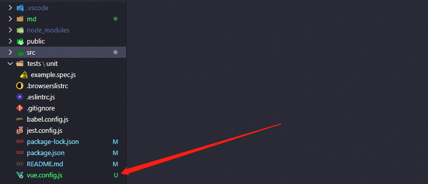

然后根据规范，填入内容：

```js
// vue.config.js
module.exports = {
  // 选项...
}
```

接下来就是写我们的选项，我们可以找到和 `css` 样式相关的内容：

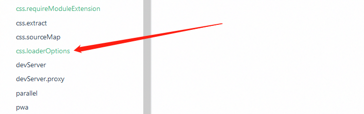

##### # `css.loaderOptions`

- Type: `Object`

- Default: `{}`

向 CSS 相关的 loader 传递选项。例如：

```js
module.exports = {
  css: {
    loaderOptions: {
      css: {
        // 这里的选项会传递给 css-loader
      },
      postcss: {
        // 这里的选项会传递给 postcss-loader
      }
    }
  }
}
```

示例中提示我们相应的代码处可以传递给 `css-loader` 和 `postcss-loader`，往下拉一些，可以看到他支持的 `loader` 也包含 `less` ：

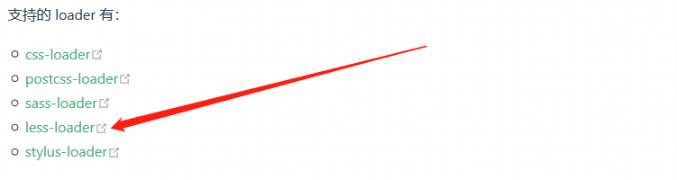

那么，现在就已经很明确了，我们要作的就是配置这个：

```js
// vue.config.js
module.exports = {
  css: {
    loaderOptions: {
      less: {
         // less 配置
      }
    }
  }
};
```

然后，我们就把刚才看到解决方案的代码复制进来：

```js
// vue.config.js
module.exports = {
  css: {
    loaderOptions: {
      less: {
        javascriptEnabled: true
      }
    }
  }
};
```

保存后重新启动我们的工程。此时项目可以成功运行了，页面展示和渲染也都没有问题了。

我们打开“网络”查看我们的静态资源文件：


我们现在只使用了“`Antd`”的一个 `button` 的一个文件，那现在我们其实是把 `Antd` 的50多个组件全部全局注册了，但是，实际上我们开发的时候，并不需要那么多，可能只是需要1-2个，甚至可能只是需要一个 `button`。那这个时候，如果我们不去做一些处理的话，我们会看到在静态资源文件中，有一个特别大的资源文件，有`13.9M` 的一个资源文件：

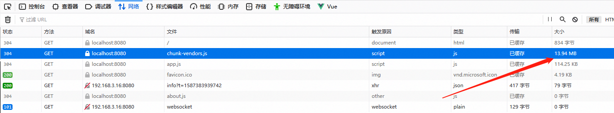

请注意查看时，我们先将缓存禁用掉：

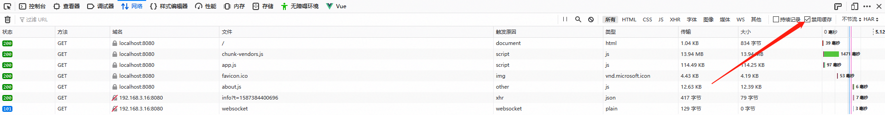


那我们如何优化呢？如果我们只需要使用一个 `<button>` 组件的话，我们只需要在入口文件的引入时，引入这个 `button` 即可：

```js
// 引入我们所需要的组件，例如 button
import { Button } from "ant-design-vue";
```

同样，包括我们的样式文件也是可以按需引入的：

```js
// 包括我们的样式也是可以按需引入的
import "ant-design-vue/lib/button/style";
```

画面的渲染依然成功了：

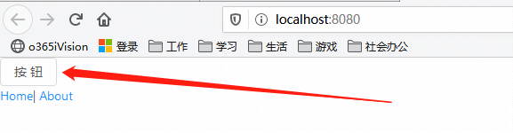

此时，页面静态文件的加载量如下：

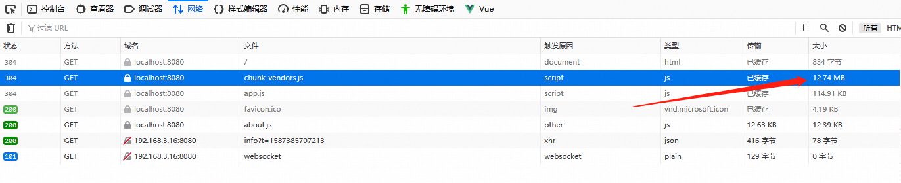

不对，写法有错误，我们修改下引入组件的语句：

```js
// 引入我们所需要的组件，例如 button
import Button from "ant-design-vue/lib/button";
```

这个时候页面正常显示，且静态资源的大小减少到了`5.7M`，原来的一半了：

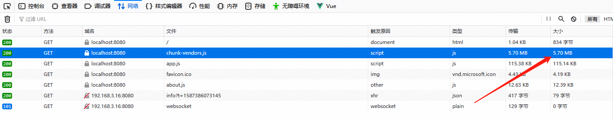

那这个时候，如果我还想用 `checkbox`、`radiobutton`，那没个组件我都要这样去写：

- 单独引入组件
- 单独引入样式
- `Vue.use(....)`

那显然是非常繁琐的一件事情！这个时候我们就可以通过我们 `babel ` 的一个插件，而去自动的帮我们去做这样的一件事情。


#### 配置 babel

我们去 `ant-design-vue` 官网确认官方推荐方式：

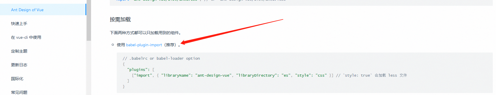

我们现在要作的就是自定义我们 babel 的一个配置：

```js
module.exports = {
  presets: ["@vue/cli-plugin-babel/preset"],
  // 引入我们的 ant-design-vue 
  plugins: [
    [
      "import",
      { libraryName: "ant-design-vue", libraryDirectory: "es", style: true }
    ] // `style: css` 加载css文件，`style: true` 会加载 less 文件
  ]
};
```

然后只需从 `ant-design-vue` 引入模块即可，无需单独引入样式。等同于下面手动引入的方式。

```js
// babel-plugin-import 会帮助你加载 JS 和 CSS
import { Button } from 'ant-design-vue';
```

> 样式也不用单独写了，`babel` 会帮你加载的

这个时候，需要重启下，才能看到修改后的结果。

> 配置文件不会热加载！

当然，我们也可以在今后的使用中加载其他的，他同样也会自动的帮我们加载，这样就完成了我们的一个按需加载的一个配置：

```js
import { Button, Input } from 'ant-design-vue';
```

现在启动后台有个报错没有找到`babel-plugin-import`：

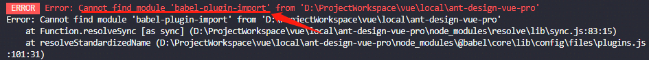

这是我们需要将这个模块进行安装，运行如下命令：

```sh
npm i --save-dev babel-plugin-import
```

> 我们将它安装在 dev 的 dependency 下面。

完成安装后，在根目录下的 `package.json` 添加了一行，证明我们安装完成：

```js
"babel-plugin-import": "^1.13.0",
```

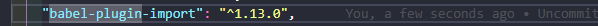

完成安装后，启动下服务，看看是否已经完成了我们一个按需加载的配置

- 画面成功渲染：

  

- 同时也完成了按需加载的需求，5.7M大小静态文件：

  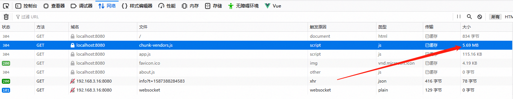


### 34 | 如何设计一个高扩展性的路由

这节课我们来实现 `pro` 项目的路由。现在市场上一般是有两类的一个路由方案：
- 一个是基于约定的，所谓基于约定，就是现在第三方的轮子他提供的一些工具。然后我们通过它约定的一些规则去书写我们的文件。然后它通过工具去帮我们去转成我们的配置文件。例如我们的`noct`它就是按照我们约定，在我们配置的目录下编译文件。然后通过工具的形式去帮我们生成我们的一个路由配置。实际上它最终还是我们的 `Vue-router` 的一个路由配置。包括我们的 `react` 的 `pro` 他是基于 `umy` 去做的，去帮我们去转换我们的规则。

我们 vue 版的 `pro` 就会按照我们 vue 的规则和配置去写。

我们先来打开 `react pro` 的登录页面：


右下方有注册：


我们可以看到有路由的变化。这个就是他路由的一个方案。这里的登录和注册，基本上是一致的，一个大背景图。


登录后，我们会看到一个系统的内容页，左侧是菜单，右侧是内容栏，然后分了头尾：


#### 登录注册的路由配置

那我们就先来写我们的登录和注册页面的路由。

为了方便我们以后的扩展，我们使用一个嵌套路由：

```js
const routes = [
  {
    // 先指向 user
    path: "/user",
    // user下面是我们的一个嵌套路由
    // children 下面有我们的登录页和注册页
    children: [
      // 登录页
      {
        path: "/user/login",
        // 取个名称
        name: "login",
        // 还要对应一个组件
        // 对应的组件的话都使用异步加载，都使用这种方式：
        // webpackChunkName 可以根据我们的需要改成 “user”，这样在webpack在打包的时候就会将标识为“user”的都打在一个包里面
        component: () =>
          import(/*webpackChunkName: "user" */ "./user/About.vue")
      },
      // 注册页
      {
        path: "/user/register",
        // 取个名称
        name: "register",
        // 还要对应一个组件
        // 对应的组件的话都使用异步加载，都使用这种方式：
        // webpackChunkName 可以根据我们的需要改成 “user”，这样在webpack在打包的时候就会将标识为“user”的都打在一个包里面
        component: () =>
          import(/*webpackChunkName: "user" */ "./user/About.vue")
      }
    ]
  },
  {
    path: "/",
    name: "Home",
    component: Home
  },
  {
    path: "/about",
    name: "About",
    // route level code-splitting
    // this generates a separate chunk (about.[hash].js) for this route
    // which is lazy-loaded when the route is visited.
    component: () =>
      import(/* webpackChunkName: "about" */ "../views/About.vue")
  }
];
```

然后在我们的 `views` 下面新建我们的目录，专门存放我们和用户相关的一些组件：


此时，我们2个组件已经有了，但是我们去访问这个配置的路由“/user”时，并不会去加载到对应下面的组件，因为我们需要在 `path` 的同级属性下，提供一个 `router-view` 的占位符组件（component）。让我们去匹配到 `path` 路径时，能够将对应的组件挂载到这个  `router-view` 的占位符组件所在的地方。

- 新建一个 `router-view` 占位符组件：

  

  ```html
  <template>
    <router-view></router-view>
  </template>
  
  <script>
  export default {};
  </script>
  
  <style scoped></style>
  ```

  ```js
  // 引入
  import RenderRouterView from "../components/RenderRouterView.vue"
  ```

  ```js
  // 挂载
  // 先指向 user
  path: "/user",
  // router-view 占位符
  // 这个组件我们可以专门去创建一个组件，用来挂载我们的 router-view的
  // 然后引入并使用这个创建的占位符组件
  component: RenderRouterView,
  ```

这个时候，我们去访问路径 “/user/login”时，就能够访问到相应的组件了！现在我们去浏览器确认下路由的配置是否生效：


可以看到，我们的登录和注册页已经成功的挂载到这里了。

但是，我们还有个更加简便的方式，那就是我们提供的 `RenderRouterView` 占位符组件不用单独去写一个了。

还记得之前讲过的 `<template>` 和 `JSX` 最终的本质都会去转译成我们的 `render` 函数，这里我们就可以使用我们的 `render` 函数，`render` 函数使用起来就会非常的简便了，我们将占位符组件的部分修改为：

```js
// 用 render 函数来替代占位符组件
component: { render: h => h("router-view") },
```

这样写之后，我们就不再需要我们的占位符组件了。重新运行程序，并浏览器访问，效果一样：


> 这样就简便了很多


#### 页面布局组件的路由配置

参考 `react pro` 的登录页面和注册页面都有个背景图片，还有一些布局的信息。这个时候，我们就需要给我们的登录页和注册页提供一个布局的信息，然后在布局里面提供我们一个 `router-view` 的一个挂载项。

我们先将我们的布局放在一个 `layouts` 的目录里面，因为这里面会涉及除了用户的路由，还有待会要写到的我们整个的一个内容页的一个路由。我们新建一个 `layout` 组件：


```html
<template>
  <div>
    <!-- 这里可以写一些简单的信息 -->
    <div class="desc">Ant Design Vue Pro</div>
    <router-view></router-view>
  </div>
</template>

<script>
export default {};
</script>

<style></style>
```

然后修改我们的路由配置，将原来使用 `render` 函数进行渲染的方式修改为异步加载调用的方式：

```js
// 同样使用异步加载的方式来加载我们的用户布局组件
// 同样设置 webpack 的打包，都打到 layout 文件夹下
component: () =>
	import(/*webpackChunkName: "layout" */ "../layouts/UserLayout.vue"),
```

这个时候我们再打开浏览器确认下：


> 可以看到，刚才我们写的 “`Ant Design Vue Pro`”也出现在页面上了，证明我们挂载成功了

页面的一些渲染效果，就靠后期自己实现了。


#### 重定向

那除了我们现在提供的这个 `/user/login` 和 `user/register` 能够访问到对应的组件页面外，一般情况下，如果我们直接访问 `/user` 的时候，也会提供一个重定向，然后去直接访问到我们的 `/user/login` 或者 `/user/register` 根据项目需求而定。

基于上述的需求下，我们再修改路由配置，在子路由  `Children` 下再挂一个：

```js
children: [
   {
      // 匹配到 user 时，我们重定向到login页
      path: "/user",
      redirect: "/user/login"
   },
   // 登录页
   {
      path: "/user/login",
      // 取个名称
      name: "login",
      // 还要对应一个组件
      // 对应的组件的话都使用异步加载，都使用这种方式：
      // webpackChunkName 可以根据我们的需要改成 “user”，这样在webpack在打包的时候就会将标识为“user”的都打在一个包里面
      component: () =>
      import(/*webpackChunkName: "user" */ "../views/User/Login.vue")
   },
   // 注册页
   {
      path: "/user/register",
      // 取个名称
      name: "register",
      // 还要对应一个组件
      // 对应的组件的话都使用异步加载，都使用这种方式：
      // webpackChunkName 可以根据我们的需要改成 “user”，这样在webpack在打包的时候就会将标识为“user”的都打在一个包里面
      component: () =>
      import(/*webpackChunkName: "user" */ "../views/User/Register.vue")
   }
]
```

> 这样，当我们在浏览器中输入 “/user”时，将重定向“/user/login”画面

这样我们的登录和注册的路由都已经完成了，现在就是要配置我们的仪表盘和 `FORM` 表单的路由，这里的写法和方式与我们的 `user` 是一致的，所以我们直接复制后修改下即可，代码片段如下：

```js
{
    path: "/",
    component: () => {
      import(/*webpackChunkName: "layout" */ "../layouts/BasicLayout.vue");
    },
    children: [
      // dashboard
      {
        path: "/",
        // 仪表盘下面有个分析页
        redirect: "/dashboard/analysis"
      },
      {
        path: "/dashboard",
        name: "dashboard",
        // render 方式直接渲染我们的“router-view”
        component: { render: h => h("router-view") },
        // dashboard 下面的子路由（嵌套路由）
        children: [
          {
            path: "/dashboard/analysis",
            name: "analysis",
            // 异步调用我们需要显示的组件页面
            component: () =>
              import(
                /*webpackChunkName: "dashboard" */ "../views/Dashboard/Analysis.vue"
              )
          }
        ]
      },
      // form
      {
        path: "/form",
        name: "form",
        // 同样也是利用了 render 函数帮我们直接渲染一个 router-view 然后挂载需要显示的组件
        component: { render: h => h("router-view") },
        children: [
          // 基础表单
          {
            path: "/form/basic-form",
            name: "basicform",
            component: () =>
              import(
                /*webpackChunkName: "form" */ "../views/Dashboard/Analysis.vue"
              )
          },
          // 分步表单
          {
            path: "/form/step-form",
            name: "stepform",
            component: () =>
              import(
                /*webpackChunkName: "form" */ "../views/Dashboard/Analysis.vue"
              ),
            // 继续嵌套
            children: [
              {
                path: "/form/step-form",
                redirect: "/form/step-form/info"
              },
              {
                // form 表单的第一页，也就是信息页
                path: "/form/step-form/info",
                name: "info",
                component: () =>
                  import(
                    /*webpackChunkName: "form" */ "../views/Dashboard/Analysis.vue"
                  )
              },
              {
                // 确认页
                path: "/form/step-form/confirm",
                name: "confirm",
                component: () =>
                  import(
                    /*webpackChunkName: "form" */ "../views/Dashboard/Analysis.vue"
                  )
              },
              {
                // 结果页
                path: "/form/step-form/result",
                name: "result",
                component: () =>
                  import(
                    /*webpackChunkName: "form" */ "../views/Dashboard/Analysis.vue"
                  )
              }
            ]
          }
        ]
      }
    ]
  },
```

然后分别去新建我们对应的组件。其中 `dashboard` 和 `form` 表单的 `layout` 和我们 `user` 的是不一致的，相对来说，比较复杂一些，但是 `dashboard` 和 `form` 表单的 `layout` 是一致的，所以我们就可以把它配置在我们的根路径下面：

```js
path: "/",
component: () => {
	import(/*webpackChunkName: "layout" */ "../layouts/BasicLayout.vue");
}
```

1. 我们先在 `layout` 文件夹下新建我们的 `BasicLayout` ，这个 `layout` 组件就不会像我们写 `user layout` 那么简单了，大家也看到了，他包含有我们的 `header` 、 `footer` 和 `menue` 以及我们的内容，这些内容，我们可以在 `layout` 里都创建好对应的组件：

   

   

2. 然后在我们的 `BasicLayout` 中引入进来：

   ```js
   <script>
   // 引入 Header、Footer、SiderMenu
   // 引入进来后是无法直接在 <template> 中使用的，需要注册到当前组件的 vue 实例的 components 选项上才可以使用
   import Header from "./Header";
   import Footer from "./Footer";
   import SiderMenu from "./SiderMenu";
   
   export default {
     components: {
       // 注册到 vue 实例的 components 选项上
       Header,
       Footer,
       SiderMenu
     }
   };
   </script>
   ```

   然后在 `<template>` 中使用它：

   ```html
   <template>
     <div>
       <!-- 在实例上注册过的引入组件，就可以使用了 -->
       <Header />
       <SiderMenu />
     	 <!-- 内容页 -->    
       <router-view></router-view>
       <Footer />
       
     </div>
   </template>
   ```

   > 这时，没有样式的 `BasicLayout` 就已经完成了配置

3. 接着去新建我们的 `views` 页面，这些内容将显示在`BasicLayout` 对应的 `router-view` 上：

   > 看源代码吧，很多。


#### 404 页面

我们的路由不可能覆盖到我们所有的路径情况，当用户随便输入的时候，我们要给她一个有效的反馈。我们可以用一个通配符“*”

```js
{
   path: "*",
	name: "404",
	// 不用404的方式，直接引入后使用
	component: NotFound
}
```

> 需要在头部引入 `import NotFound from "../views/404" `


#### `nprogress` 库

实际上在切换路由的时候，我们希望能够给用户一些友好的提示，这时候，我们可以是用 `nprogress` 这样一个库，来去做我们一个的加载的一个状况效果。

首先安装 `nprogress`，控制台输入：

```sh
npm i nprogress
```

等待装载完毕后，我们就可以直接使用了。先在路由文件的头部引入：

```js
import NProgress from "nprogress";
// 样式文件
import "nprogress/nprogress.css";
```

对于路由，其实 `vue-router` 还给我们提供了一个路由守卫，所谓的路由守卫，也就是说，我们在路由切换的时候，他都会先去通过这样一个钩子（守卫），我们在这里面可以去执行一些逻辑：

```js
// router 路由下会有个 beforeEach 
// 3个参数：to，from， next
// to：将要到达的路由
// from：当前的路由
// next：相当于下一步，当我们的处理钩子结束后需要执行 next 否则他就不会跳转了
router.beforeEach((to, from, next) => {
  NProgress.start();
  next();  
})

// NProgress 开始之后要有个结束
router.afterEach(() => {
  NProgress.done();
});
```


现在，我们将 `App.vue` 下的内容修改下：

```html
<template>
  <div id="app">
    <div id="nav">
      <router-link to="/dashboard/analysis">dashboard</router-link>|
      <router-link to="/form">form</router-link>
    </div>
    <router-view />
  </div>
</template>

<style lang="less"></style>
```


