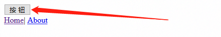
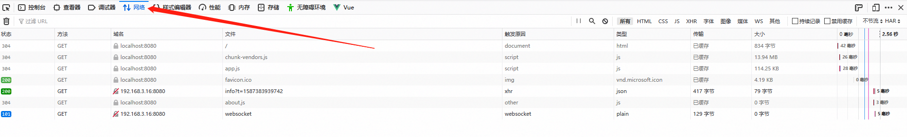

# ant-design-vue-pro

## Project setup
```
npm install
```

### Compiles and hot-reloads for development
```
npm run serve
```

### Compiles and minifies for production
```
npm run build
```

### Run your unit tests
```
npm run test:unit
```

### Lints and fixes files
```
npm run lint
```

### Customize configuration
See [Configuration Reference](https://cli.vuejs.org/config/).


### 33 | 如何自定义 Webpack 和 Babel 配置
2020/04/20 18:37

如果项目工程创建伊始没有引入 `ant-design-vue` 的 JS 组件库的话，请通过如下命令引入：
```sh
npm install --save ant-design-vue
```

#### 引入组件
在入口文件 `main.js` 中引入
```js
import Antd from "ant-design-vue";
```
然后通过如下方式将 `ant-design-vue` 提供给我们的所有的组件都全局注册：
```js
Vue.use(Antd);
```
这个时候我们就可以使用了。我们在 `App.vue` 中尝试使用一个按钮：

```html
<!-- 使用 ant-design-vue 的按钮 -->
<a-button>按钮</a-button>
```

此时页面渲染如下：



竟然没有样式~！那是因为我们没有引入样式文件，我们通过下面的命令进行引入。

同样，也是在入口文件中进行引入：

```js
import "ant-design-vue/dist/antd.css";
```

> 如果是要用 ` css` 的话，后缀是 `.css`

再去页面确认，已经有样式了：


但是，我们是想用 `less`，因为后面我们想要自定义我们的主题，只需要将后缀名修改为 `.less` ：

```js
import "ant-design-vue/dist/antd.less";
```

这个时候，页面有报错信息：


我们可以看到画面上有个 `Issue` 地址，显然这个地址和报错信息是有关的：


我们在浏览器中输入这个 `Issue` 地址，来到这个 Issue 下面：


这里有个解决方法，可以查看点赞的人数，判断是否对自己有用：


再往下，我们可以看到一个明确的解决方案：


> 那就是开启 JavaScript 就可以了，也就是 `javascriptEnabled: true`

下面还有个解决方案，点赞人数比较多，回头可以尝试下：


#### 配置 `webpack`

现在就根据提供的解决方案去配置我们的 `less - loader`，这个实际上就是我们 `webpack` 的一个配置，现在我们要做的就是，在我们的项目中，去自定义我们的 `webpack` 的配置。

因为，我们是依赖 CLI 脚手架生成我们的工程的，他在创建项目时，帮我们做了很多 `webpack` 的配置，那如果我们要自定义 `webpack` 的配置的话，就必须遵循 CLI 提供的一些接口的形式。

这个时候，我们去打开 CLI 官网，我们先要搜寻怎么配置 `webpack` 这样的一个配置。下面是 CLI 提供给我们的 `vue.config.js`，这里是去做我们配置的一个文件。

首先，在项目的根路径下去新建一个 `vue.config.js` 文件：


然后根据规范，填入内容：

```js
// vue.config.js
module.exports = {
  // 选项...
}
```

接下来就是写我们的选项，我们可以找到和 `css` 样式相关的内容：


##### # `css.loaderOptions`

- Type: `Object`

- Default: `{}`

向 CSS 相关的 loader 传递选项。例如：

```js
module.exports = {
  css: {
    loaderOptions: {
      css: {
        // 这里的选项会传递给 css-loader
      },
      postcss: {
        // 这里的选项会传递给 postcss-loader
      }
    }
  }
}
```

示例中提示我们相应的代码处可以传递给 `css-loader` 和 `postcss-loader`，往下拉一些，可以看到他支持的 `loader` 也包含 `less` ：


那么，现在就已经很明确了，我们要作的就是配置这个：

```js
// vue.config.js
module.exports = {
  css: {
    loaderOptions: {
      less: {
         // less 配置
      }
    }
  }
};
```

然后，我们就把刚才看到解决方案的代码复制进来：

```js
// vue.config.js
module.exports = {
  css: {
    loaderOptions: {
      less: {
        javascriptEnabled: true
      }
    }
  }
};
```

保存后重新启动我们的工程。此时项目可以成功运行了，页面展示和渲染也都没有问题了。

我们打开“网络”查看我们的静态资源文件：



我们现在只使用了“`Antd`”的一个 `button` 的一个文件，那现在我们其实是把 `Antd` 的50多个组件全部全局注册了，但是，实际上我们开发的时候，并不需要那么多，可能只是需要1-2个，甚至可能只是需要一个 `button`。那这个时候，如果我们不去做一些处理的话，我们会看到在静态资源文件中，有一个特别大的资源文件，有`13.9M` 的一个资源文件：


请注意查看时，我们先将缓存禁用掉：


那我们如何优化呢？如果我们只需要使用一个 `<button>` 组件的话，我们只需要在入口文件的引入时，引入这个 `button` 即可：

```js
// 引入我们所需要的组件，例如 button
import { Button } from "ant-design-vue";
```

同样，包括我们的样式文件也是可以按需引入的：

```js
// 包括我们的样式也是可以按需引入的
import "ant-design-vue/lib/button/style";
```

画面的渲染依然成功了：


此时，页面静态文件的加载量如下：


不对，写法有错误，我们修改下引入组件的语句：

```js
// 引入我们所需要的组件，例如 button
import Button from "ant-design-vue/lib/button";
```

这个时候页面正常显示，且静态资源的大小减少到了`5.7M`，原来的一半了：


那这个时候，如果我还想用 `checkbox`、`radiobutton`，那没个组件我都要这样去写：

- 单独引入组件
- 单独引入样式
- `Vue.use(....)`

那显然是非常繁琐的一件事情！这个时候我们就可以通过我们 `babel ` 的一个插件，而去自动的帮我们去做这样的一件事情。


#### 配置 babel

我们去 `ant-design-vue` 官网确认官方推荐方式：


我们现在要作的就是自定义我们 babel 的一个配置：

```js
module.exports = {
  presets: ["@vue/cli-plugin-babel/preset"],
  // 引入我们的 ant-design-vue 
  plugins: [
    [
      "import",
      { libraryName: "ant-design-vue", libraryDirectory: "es", style: true }
    ] // `style: css` 加载css文件，`style: true` 会加载 less 文件
  ]
};
```

然后只需从 `ant-design-vue` 引入模块即可，无需单独引入样式。等同于下面手动引入的方式。

```js
// babel-plugin-import 会帮助你加载 JS 和 CSS
import { Button } from 'ant-design-vue';
```

> 样式也不用单独写了，`babel` 会帮你加载的

这个时候，需要重启下，才能看到修改后的结果。

> 配置文件不会热加载！

当然，我们也可以在今后的使用中加载其他的，他同样也会自动的帮我们加载，这样就完成了我们的一个按需加载的一个配置：

```js
import { Button, Input } from 'ant-design-vue';
```

现在启动后台有个报错没有找到`babel-plugin-import`：


这是我们需要将这个模块进行安装，运行如下命令：

```sh
npm i --save-dev babel-plugin-import
```

> 我们将它安装在 dev 的 dependency 下面。

完成安装后，在根目录下的 `package.json` 添加了一行，证明我们安装完成：

```js
"babel-plugin-import": "^1.13.0",
```


完成安装后，启动下服务，看看是否已经完成了我们一个按需加载的配置

- 画面成功渲染：

  

- 同时也完成了按需加载的需求，5.7M大小静态文件：

  


